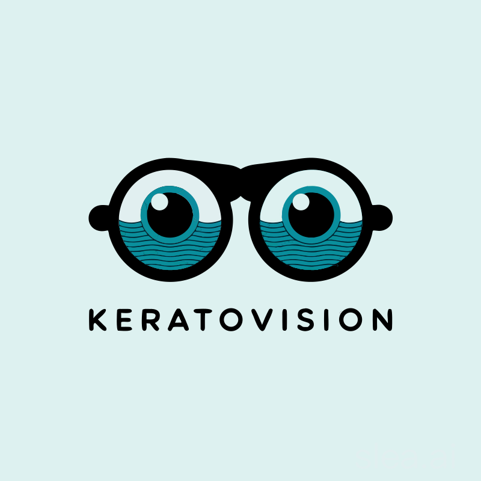

<div align="center">



# KeratoVision

**Adaptive Rendering Engine for Screen Readability**

*Designed for Keratoconus & Astigmatism*

[](chrome/)
[](firefox/)
[](vscode-theme/)
[](LICENSE)
[](https://buymeacoffee.com/r1z4x)

[English](#english) · [Türkçe](#türkçe) · [Русский](#русский) · [Español](#español)

</div>

---

## English

### What is KeratoVision?

KeratoVision is a browser extension and editor theme that adapts screen content for people with **keratoconus** and **astigmatism**. It reduces contrast, corrects ghosting, adjusts font sizes, and applies edge enhancement - all calibrated to your prescription.

### Why I Built This

I have keratoconus. I spend most of my day in front of a screen, and honestly, it sucks. Text ghosts, whites burn my eyes, letters blur into each other. I went through every dark mode, every accessibility extension, every "eye-friendly" font out there. None of them solved my actual problem because none of them were built for it. So I built my own.

### Features

- 🎯 **7-Step Calibration Wizard** - Enter your prescription, test contrast, ghosting axis, font size, brightness
- 🔄 **Adaptive Contrast** - Reduces harsh black/white without losing readability
- 👻 **Ghost Vector Compensation** - Shadow-based correction aligned to your astigmatic axis
- 🔤 **Font Engine** - Minimum size enforcement + letter-spacing optimization
- 💡 **Luminance Controller** - Clamps brightness to reduce glare sensitivity
- ⚡ **Edge Enhancement** - Gabor-inspired text-stroke for sharper character boundaries
- 📖 **Reading Guide** - Line-tracking overlay for focus retention
- 🌈 **Chromatic Correction** - Reduces color fringing from corneal irregularity
- 🌍 **4 Languages** - English, Turkish, Russian, Spanish

### Platforms

| Platform | Type | Install |
|----------|------|---------|
| **Chrome** | Extension (MV3) | Load `chrome/` as unpacked |
| **Firefox** | Add-on (MV2) | Load `firefox/` via `about:debugging` |
| **VS Code / Cursor** | Dynamic Theme | `code --install-extension dist/*.vsix` |

### Build

```bash
make all            # Build all packages
make release-patch  # Bump version + build
make help           # See all commands
```

### References

1. Vinas, M. et al. (2023). *Impact of low astigmatism on visual performance.* - MDPI Vision Sciences
2. Romero-Jiménez, M. et al. (2010). *Keratoconus: A review.* Contact Lens & Anterior Eye, 33(4), 157-166
3. Sheedy, J.E. et al. (2005). *Text legibility and letter superiority effect.* Human Factors, 47(4), 797-815
4. Atchison, D.A. et al. (2020). *Contrast sensitivity function in keratoconus.* - Clinical & Experimental Optometry

---

## Türkçe

### KeratoVision Nedir?

KeratoVision, **keratokonus** ve **astigmatizm** hastalarına yönelik bir tarayıcı eklentisi ve editör temasıdır. Kontrast azaltma, hayalet görüntü düzeltme, font boyutu ayarı ve kenar güçlendirme gibi reçetenize göre kalibre edilen bir uygulamadır.

### Neden Yaptım?

Keratokonusum var. Günümün büyük kısmını ekran başında geçiriyorum ve düpedüz zor. Metinler gölgeleniyor, beyaz arka planlar gözlerimi yakıyor, harfler birbirine giriyor. Piyasadaki her karanlık modu, her erişilebilirlik eklentisini, her "göz dostu" fontu denedim. Hiçbiri benim sorunumu çözmedi çünkü hiçbiri bunun için yapılmamıştı. O yüzden kendim yazdım.

### Özellikler

- 🎯 **7 Adımlı Kalibrasyon** - Reçete girişi, kontrast, eksen, font, parlaklık testleri
- 🔄 **Adaptif Kontrast** - Okunabilirliği koruyarak sert siyah/beyazı azaltır
- 👻 **Hayalet Vektör Telafisi** - Astigmat ekseninize hizalı gölge düzeltme
- 🔤 **Font Motoru** - Minimum boyut + harf aralığı optimizasyonu
- 💡 **Parlaklık Kontrolü** - Parlama hassasiyetini azaltan sınırlama
- ⚡ **Kenar Güçlendirme** - Gabor tarzı metin çizgisi
- 📖 **Okuma Kılavuzu** - Satır takip katmanı
- 🌈 **Kromatik Düzeltme** - Kornea düzensizliğinden kaynaklanan renk saçaklanmasını azaltır

### Kaynaklar

1. Vinas, M. ve ark. (2023). *Düşük astigmatizmanın görsel performansa etkisi.* - MDPI Vision Sciences
2. Romero-Jiménez, M. ve ark. (2010). *Keratokonus: Bir derleme.* Contact Lens & Anterior Eye
3. Sheedy, J.E. ve ark. (2005). *Metin okunabilirliği ve harf üstünlüğü etkisi.* Human Factors
4. Atchison, D.A. ve ark. (2020). *Keratokonusta kontrast duyarlılık fonksiyonu.* - Clinical & Exp. Optometry

---

## Русский

### Что такое KeratoVision?

KeratoVision - расширение для браузера и тема для редактора, адаптирующая содержимое экрана для людей с **кератоконусом** и **астигматизмом**. Снижение контраста, коррекция двоения, регулировка размера шрифта и усиление краёв - всё калибруется по вашему рецепту.

### Почему я это создал?

У меня кератоконус. Большую часть дня я провожу перед экраном, и это реально тяжело. Текст двоится, белый фон обжигает глаза, буквы сливаются. Я перепробовал все тёмные режимы, все расширения для доступности, все "щадящие" шрифты. Ничего не помогло, потому что ничего из этого не было сделано под мою проблему. Поэтому я написал своё.

### Возможности

- 🎯 **7-шаговая калибровка** - рецепт, контраст, ось двоения, шрифт, яркость
- 🔄 **Адаптивный контраст** - смягчение без потери читаемости
- 👻 **Компенсация вектора двоения** - теневая коррекция по оси астигматизма
- 🔤 **Шрифтовый движок** - минимальный размер + межбуквенный интервал
- 💡 **Контроль яркости** - ограничение бликов
- ⚡ **Усиление краёв** - чёткие границы символов
- 📖 **Направляющая чтения** - отслеживание строки
- 🌈 **Хроматическая коррекция** - уменьшение цветовых ореолов

### Источники

1. Vinas, M. et al. (2023). *Влияние слабого астигматизма на зрительные функции.* - MDPI Vision Sciences
2. Romero-Jiménez, M. et al. (2010). *Кератоконус: обзор.* Contact Lens & Anterior Eye
3. Sheedy, J.E. et al. (2005). *Разборчивость текста.* Human Factors
4. Atchison, D.A. et al. (2020). *Контрастная чувствительность при кератоконусе.* - Clinical & Exp. Optometry

---

## Español

### ¿Qué es KeratoVision?

KeratoVision es una extensión de navegador y tema de editor que adapta el contenido de la pantalla para personas con **queratocono** y **astigmatismo**. Reduce el contraste, corrige el efecto fantasma, ajusta el tamaño de fuente y mejora los bordes - todo calibrado según su receta óptica.

### ¿Por qué lo construí?

Tengo queratocono. Paso la mayor parte del día frente a una pantalla, y la verdad, es difícil. El texto se duplica, los blancos queman los ojos, las letras se difuminan. Probé todos los modos oscuros, todas las extensiones de accesibilidad, todas las fuentes "amigables con los ojos". Nada resolvió mi problema porque nada estaba hecho para esto. Así que lo hice yo.

### Características

- 🎯 **Asistente de calibración de 7 pasos** - receta, contraste, eje, fuente, brillo
- 🔄 **Contraste adaptativo** - suaviza sin perder legibilidad
- 👻 **Compensación del vector fantasma** - corrección de sombra alineada a su eje
- 🔤 **Motor de fuentes** - tamaño mínimo + espaciado de letras
- 💡 **Control de luminancia** - limita el brillo para reducir el deslumbramiento
- ⚡ **Mejora de bordes** - trazo de texto inspirado en Gabor
- 📖 **Guía de lectura** - superposición de seguimiento de línea
- 🌈 **Corrección cromática** - reduce la aberración cromática corneal

### Fuentes

1. Vinas, M. et al. (2023). *Impacto del astigmatismo leve en el rendimiento visual.* - MDPI Vision Sciences
2. Romero-Jiménez, M. et al. (2010). *Queratocono: una revisión.* Contact Lens & Anterior Eye
3. Sheedy, J.E. et al. (2005). *Legibilidad del texto.* Human Factors
4. Atchison, D.A. et al. (2020). *Función de sensibilidad al contraste en queratocono.* - Clinical & Exp. Optometry

---

<div align="center">

[](https://buymeacoffee.com/r1z4x)

MIT License © 2025 KeratoVision

</div>
